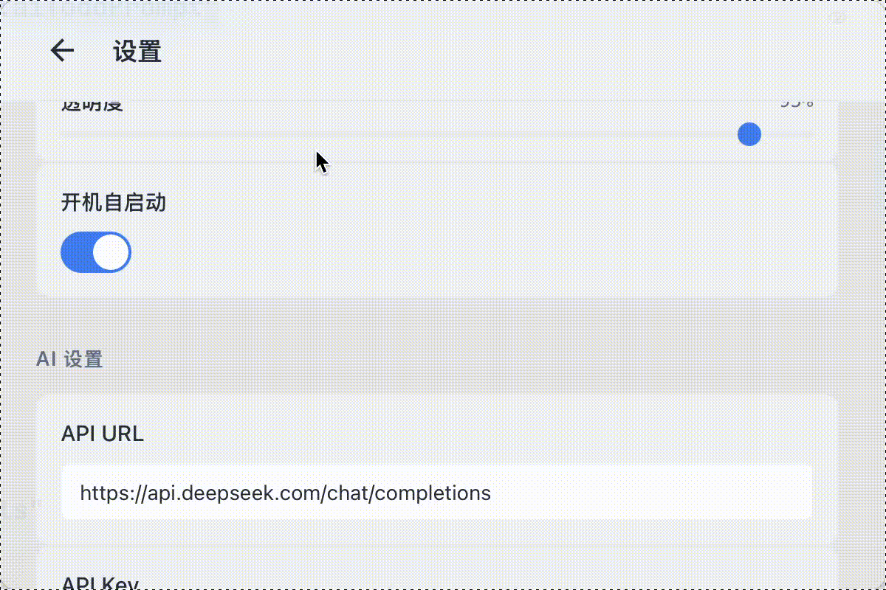
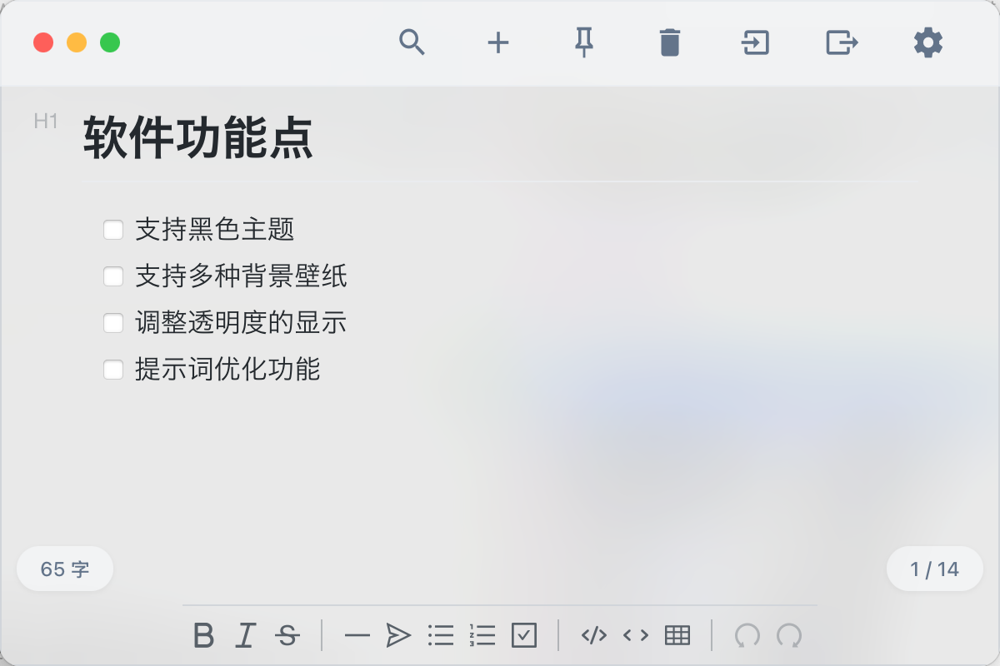
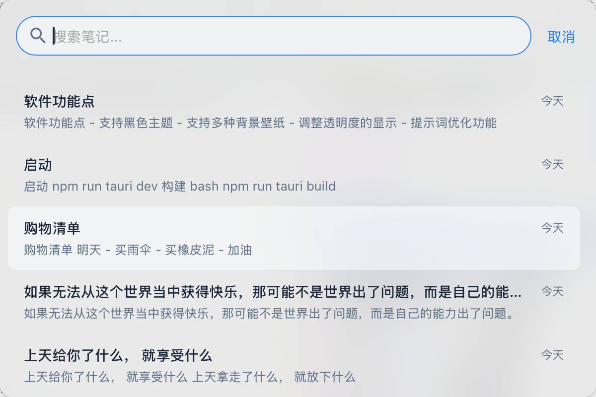
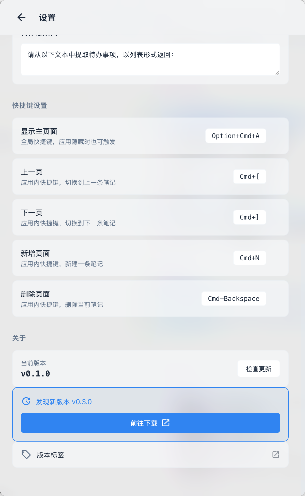

<div align="right">
  <a href="README.md">中文</a>
</div>

<div align="center">
  <h1>MarkNote</h1>
  <p>A native macOS AI-powered floating Markdown note app</p>
  <p>
    
    
    
    
  </p>
</div>

---

## About

MarkNote is a native macOS floating note app with WYSIWYG Markdown editing, AI-assisted writing, and automatic iCloud sync. Inspired by [Antinote](https://antinote.io/) — built to go further with deeper AI integration. Many thanks to the Antinote team!

> This project was developed entirely via vibe coding.

## Design Philosophy

- **Summon & Dismiss** — Global shortcut to show/hide instantly, never in your way
- **What You See Is What You Get** — Live Markdown rendering, no preview toggle needed
- **Less Is More** — Minimal UI that stays out of the way of your thoughts

## Demo



## Screenshots

| Main | Search | Settings |
|:---:|:---:|:---:|
|  |  |  |

**Right-click AI Features**


## Keyboard Shortcuts

| Shortcut | Action |
|:---|:---|
| `Cmd+Opt+A` | Toggle main window |
| `Cmd+N` | New note |
| `Cmd+F` | Search notes |
| `Cmd+[` / `Cmd+]` | Previous / Next note |
| `Cmd+Backspace` | Delete current note |
| `Cmd+P` | Pin note |
| `Cmd+,` | Open settings |
| `Esc` | Clear search |

> You can also swipe left/right on the trackpad or scroll horizontally with a mouse to switch notes.

## Features

**Implemented**

- ✅ Borderless floating window
- ✅ WYSIWYG Markdown editor (Vditor)
- ✅ Auto-save with debounce
- ✅ Global shortcut to summon/hide
- ✅ Note search
- ✅ Pin notes to top
- ✅ Keyword system
- ✅ AI writing assistant (right-click menu)
- ✅ iCloud directory storage
- ✅ Import / Export
- ✅ Dark / Light theme toggle

**Planned**

- ⏳ Code block style aligned with Typora

## Data Storage

Notes are stored in your iCloud directory for seamless multi-device sync:

```
~/Library/Mobile Documents/com~apple~CloudDocs/MarkNote/
├── metadata.json       # Note index
├── note_<uuid>.md      # Note content
└── ...
```

## Tech Stack

| Layer | Technology |
|:---|:---|
| Framework | Tauri 2.x + Vue 3.x + TypeScript |
| Editor | Vditor |
| State | Pinia 2.x |
| Styling | UnoCSS |
| Storage | Local `.md` files (iCloud directory) |

## Development

### Prerequisites

- Node.js 20+
- Rust 1.70+
- macOS 12+

### Getting Started

```bash
# Install dependencies
npm install

# Development mode
npm run tauri dev

# Build for Apple Silicon
npm run tauri build -- --target aarch64-apple-darwin

# Build for Intel
npm run tauri build -- --target x86_64-apple-darwin
```

## Troubleshooting

### "Cannot open app" (Signature Issue)

macOS Gatekeeper blocks unsigned apps. Run the following to remove the quarantine flag:

```bash
sudo xattr -r -d com.apple.quarantine /Applications/MarkNote.app/
```

---

## License

**Copyright © 2025-2026 MarkNote**

This software is for personal learning, research, and private use only. Commercial use of any kind is strictly prohibited.

### Permitted

- ✅ Personal learning, research, and private use
- ✅ Modifying source code for personal use
- ✅ Sharing with others for personal use (with original copyright preserved)

### Prohibited

- ❌ Any commercial use
- ❌ Integration into commercial products or services
- ❌ Selling, transferring, or licensing this software
- ❌ Removing or tampering with copyright information

### Disclaimer

This software is provided "AS IS" without any warranties. Users assume all risks associated with using this software.

For questions, please contact the author.
